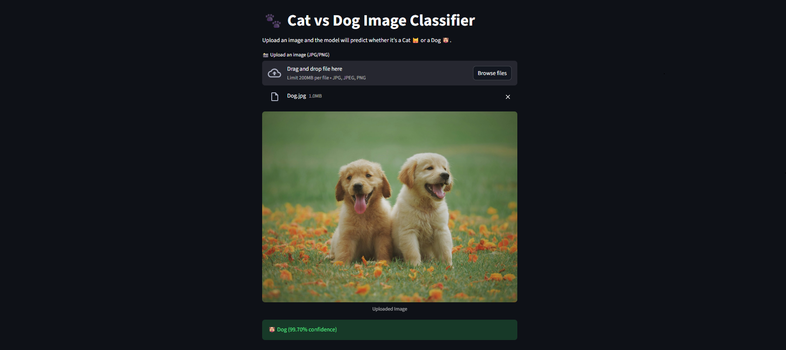
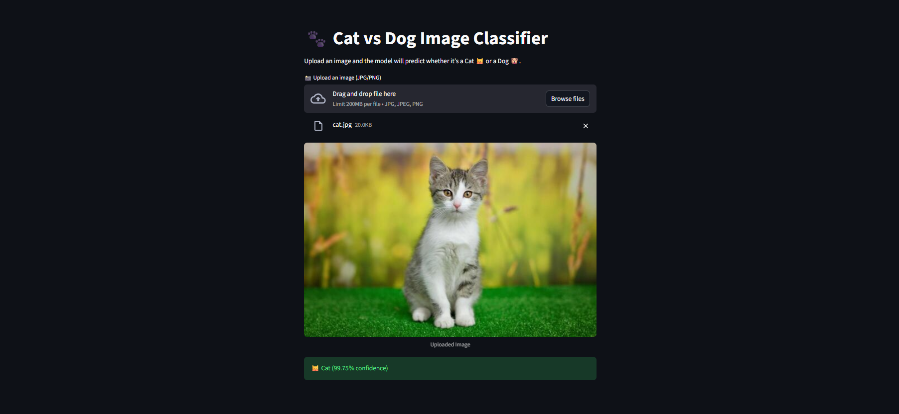

# 🐱🐶 Cat vs Dog Image Classifier

This Project is a **Deep Learning-based Image classifier** that can distinguish between **Cat** 🐱 and **Dog** 🐶. It uses **MobileNetV2** as the base model and provides a **user-friendly web interface** built with **Streamlit**.

---

## 🧰 Features

- It Classifies images as **Cat** or **Dog**.
- Pre-trained **MobileNetV2** for transfer learning.
- Simple **Streamlit web app** to upload and test images.
- Shows **confidence scores** for predictions.

---

## ⚡Technologies

- **Programming Language:** Python
- **Deep Learning Framework:** TensorFlow, Keras
- **Pre-trained Model:** MobileNetV2
- **Framework:** Streamlit
- **Image Processing:** Pillow (PIL), NumPy

---

## 📂 Project Structure

```
cat_dog_classifier/
│
├── data/
├── notebook.ipynb
│    └── Cat_vs_Dog.ipynb
│
├── results
├── cat_dog_mobilenetv2.h5
├── app.py
└── README.md
```

---

## 🖼 Screenshots

### 🐶 Dog Classification


### 🐱 Cat Classification


---

## 💡 How It Works

- **MobileNetV2** is used as the base convolutional neural network.
- The model is fine-tuned on the **Cat** vs **Dog** image.
- The Streamlit app loads the trained model and preprocesses uploaded images.
- The app predicts whether the image is a **Cat** or **Dog**, and shows confidence.

---

## 🔗 Connect with Me

**Kadulla Pravalika**
- GitHub: [Kadulla-Pravalika-28](https://github.com/Kadulla-Pravalika-28)  
- LinkedIn: [linkedin.com/in/kadulla-pravalika](https://www.linkedin.com/in/kadulla-pravalika/)  

---

## 📄 License

This project is licensed under the **MIT License** – See the [LICENSE](./LICENSE) file for details.